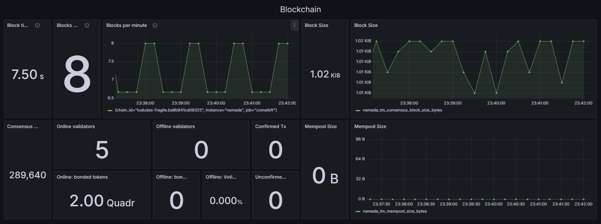

# Story Node Monitoring stack

This project provides a monitoring solution for Story Node services using Prometheus, Grafana, and Alertmanager. The stack enables real-time data visualization, monitoring, and alerting for your node's health and performance.

## Enable prometheus metrics and open ports

Before continuing make sure you have enabled prometheus metrics on both Cometbft and Geth node.

### Cometbft node configuration

Enable prometheus metrics in cometbft configuration file `config.toml`.

```bash
vim $HOME/.story/story/config/config.toml
```

Example configuration:
```toml
[instrumentation]

# When true, Prometheus metrics are served under /metrics on
# PrometheusListenAddr.
# Check out the documentation for the list of available metrics.
prometheus = true

# Address to listen for Prometheus collector(s) connections
prometheus_listen_addr = ":26660"
```

### Geth node configuration

Enable prometheus metrics by adding metrics flags to the geth execution.

Example service configuration:

```bash
[Unit]
Description=Story Execution Client service
After=network-online.target

[Service]
User=root
WorkingDirectory=~
ExecStart=/usr/local/bin/geth --iliad --syncmode full --http --ws --metrics --metrics.addr 0.0.0.0 --metrics.port 6060
Restart=on-failure
RestartSec=10
LimitNOFILE=65535

[Install]
WantedBy=multi-user.target
```

Make sure to reload systemd configuration after making changes.

```bash
systemctl daemon-reload
```

> **Note:** If you're using a firewall, ensure that the corresponding ports are open to allow Prometheus to scrape the metrics.

## Installation

Follow these steps to install the necessary dependencies and deploy the monitoring stack.

### 1. Install Docker

Install Docker, a containerization platform required for running the monitoring services:

```bash
sudo apt-get update
sudo apt-get -y install ca-certificates curl

sudo install -m 0755 -d /etc/apt/keyrings
sudo curl -fsSL https://download.docker.com/linux/ubuntu/gpg -o /etc/apt/keyrings/docker.asc
sudo chmod a+r /etc/apt/keyrings/docker.asc

echo "deb [arch=$(dpkg --print-architecture) signed-by=/etc/apt/keyrings/docker.asc] https://download.docker.com/linux/ubuntu $(. /etc/os-release && echo "$VERSION_CODENAME") stable" | sudo tee /etc/apt/sources.list.d/docker.list > /dev/null
sudo apt-get update

sudo apt-get -y install docker-ce docker-ce-cli containerd.io docker-buildx-plugin docker-compose-plugin

sudo systemctl enable docker.service containerd.service
sudo systemctl start docker.service containerd.service
```

### 2. Clone the Monitoring Stack Repository

Clone the repository that contains the monitoring stack configuration:

```bash
rm -rf $HOME/story-node-monitoring
git clone https://github.com/kjnodes/story-node-monitoring.git $HOME/story-node-monitoring
```

## Pre-Configuration

Before deploying the monitoring stack, configure Alerting and Prometheus settings.

### 1. Set Up Telegram Alerting

Configure Alertmanager to send notifications via Telegram. Update the `YOUR_TELEGRAM_BOT_TOKEN` and `YOUR_TELEGRAM_USER_ID` in the Alertmanager configuration file.

| KEY | VALUE |
|---------------|-------------|
| YOUR_TELEGRAM_USER_ID | Your Telegram user ID can be obtained from [@userinfobot](https://t.me/userinfobot). |
| YOUR_TELEGRAM_BOT_TOKEN | Get your bot token from [@botfather](https://telegram.me/botfather). Follow the steps outlined [here](https://core.telegram.org/bots#6-botfather) to create a new token. |

Edit the configuration file:

```bash
vim $HOME/story-node-monitoring/prometheus/alert_manager/alertmanager.yml
```

Example configuration:

```yml
global:
  resolve_timeout: 1m

templates: 
- 'templates/*.tmpl'

route:
  receiver: 'telegram'
  group_by: []            # Empty list to avoid grouping alerts
  group_wait: 0s          # Send notifications immediately
  group_interval: 1s      # Set a minimal interval for ongoing alerts
  repeat_interval: 4h     # Repeat notifications for ongoing alerts every 4 hours

receivers:
  - name: 'telegram'
    telegram_configs:
      - send_resolved: true
        bot_token: '74064354354:AfeDFge7zdw-oJBOyf1CuEryo9gwpFfcw'
        chat_id: 442175262
        message: '{{ template "telegram.message" . }}'
```

### 2. Configure Prometheus

Set up Prometheus by specifying the `IP` address and `ports` for your node services. Modify the `YOUR_NODE_IP:COMET_PORT` and `YOUR_NODE_IP:GETH_PORT` in the configuration file:

```bash
vim $HOME/story-node-monitoring/prometheus/prometheus.yml
```

Example configuration:

```yml
global:
  scrape_interval: 15s
  scrape_timeout: 10s
  evaluation_interval: 15s
alerting:
  alertmanagers:
    - follow_redirects: true
      scheme: http
      timeout: 10s
      api_version: v2
      static_configs:
        - targets:
            - alertmanager:9093
rule_files:
  - /etc/prometheus/alerts/alert.rules
scrape_configs:
  - job_name: prometheus
    metrics_path: /metrics
    static_configs:
      - targets:
          - localhost:9090
  - job_name: cometbft
    metrics_path: /metrics
    static_configs:
      - targets:
          - 192.168.0.1:26660
        labels:
          instance: story
  - job_name: geth
    metrics_path: /debug/metrics/prometheus
    static_configs:
      - targets:
          - 192.168.0.1:6060
        labels:
          instance: story
```

## Monitoring stack deployment

```bash
cd $HOME/story-node-monitoring
docker compose up -d
```

## Data Visualization Using Grafana

Follow these steps to access and use the Story Node Dashboard in Grafana:

1. Open Grafana in your web browser (default port: 9999).

2. Log in using the default credentials `admin/admin`, then set a new password.

3. Navigate to the `Dashboards` page to access the `Story Node Dashboard`.

## Dashboard contents

The Grafana dashboard is organized into three main sections:

### 1. kjnodes Story Services**

Contains links to kjnodes provided services for Story Protocol.


### 2. Cometbft Node Metrics

Displays key metrics for monitoring the health, performance, and activity of the CometBFT node.

#### 2.1. System

Shows system related metrics like node status, service uptime, memory and cpu usage.


#### 2.2. Network

Network metrics like node peer connections and traffic.


#### 2.3. Blockchain

Displays blockchain metrics like block time, blck size and information active validator set.



### 3. Geth Node Metrics

Shows metrics related to the health, resource consumption, and activity of the Geth node.

#### 3.1. System

Shows system related metrics like geth binary version and system resource consumption.


#### 3.2. Network

Network metrics like node peer connections and traffic.


#### 3.3. Blockchain

Displays blockchain metrics like block and transaction processing.


#### 3.4. Database

Displays database metrics like block time, blck size and information active validator set.


## Alerting and Notifications

Alertmanager triggers alerts and sends notifications via Telegram when configured conditions are met, such as degraded block synchronization or low peers.

### Alerting Rules (Conditions)

1. Alert if node is not in sync.
2. The number of connected peers is low.
3. Block production is stalled.
4. No metrics received.

Example of Telegram notification:

<div style="text-align: center;">
    
</div>

## Clean Up All Container Data

> **Warning:** This will remove all container monitoring stack data.

To stop and remove the monitoring stack and associated data, execute:

```
cd $HOME/story-node-monitoring
docker compose down --volumes
```

## Accessing the Monitoring Stack UI

You can access the monitoring tools using these ports:
- Prometheus: 9090
- Alertmanager: 9093
- Grafana: 9999
